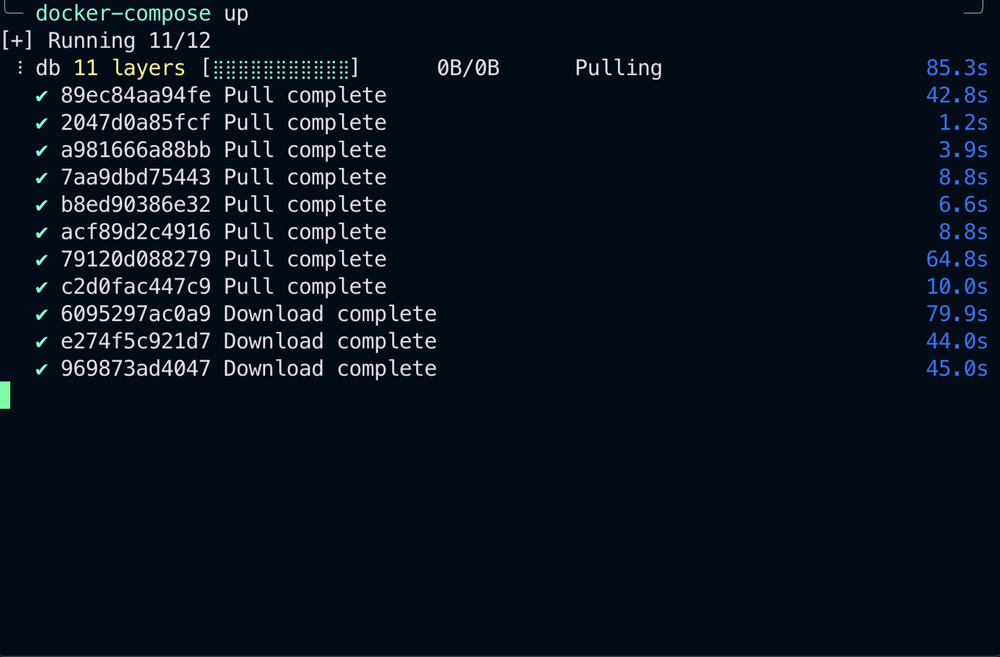

# MySqlRestApiDemo 📸
this is a simple repo that teachs one how to make a simple crud operation using spring boot. Is actually for my article name Creating a REST API for MySQL CRUD Operations using Spring BootFramework.

## 🚀 Features
1. Create (POST): Used for adding new records.

- Example endpoint: http://localhost:8080/users

- Body: {
"username": "john",
"password":"12345",
"email": "1@gmail.com"   
}

2. Read (GET): Fetches information.

- Example endpoint: http://localhost:8080/users

3. Update (PATCH/PUT): Modifies existing data.

- Example endpoint: http://localhost:8080/users

4. Delete (DELETE): Removes a record.

- Example endpoint: http://localhost:8080/users

## 🛠 Setup & Installation
1. Clone the repository:
   `git clone https://github.com/yourgithubusername/SpringMySqlRestApiDemo.git`

2. Navigate to the directory:
   `cd focusBooker`

3. Install dependencies:
   If you're using Maven:
   `mvn install`

4. Run the application:
   `mvn spring-boot:run`

Your application should now be running at http://localhost:8080.

### 🐳 Running with Docker
You can deploy the application using Docker Compose, ensuring all dependencies and settings are consistent across different environments.

1. Ensure Docker & Docker Compose are Installed

2. Start the Application
Navigate to the directory containing the docker-compose.yml file and execute:
`docker-compose up`

3. Verification
Once the application is up and running, you can use tools like Postman to verify its functionality. Below is a screenshot of docker running and a POST request made to our endpoint using Postman:

  
  

## 📜 License
This project is licensed under the MIT License.

## 🤝 Contributing
Contributions, issues, and feature requests are welcome! See our contributing guide for more details.

## Prerequisites
- Java 8 or newer
- Maven
- A suitable database, with configuration specified in application.properties

